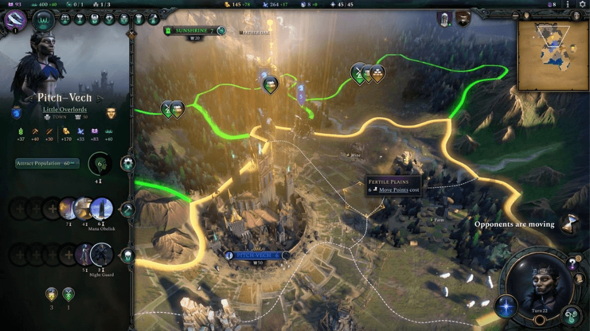
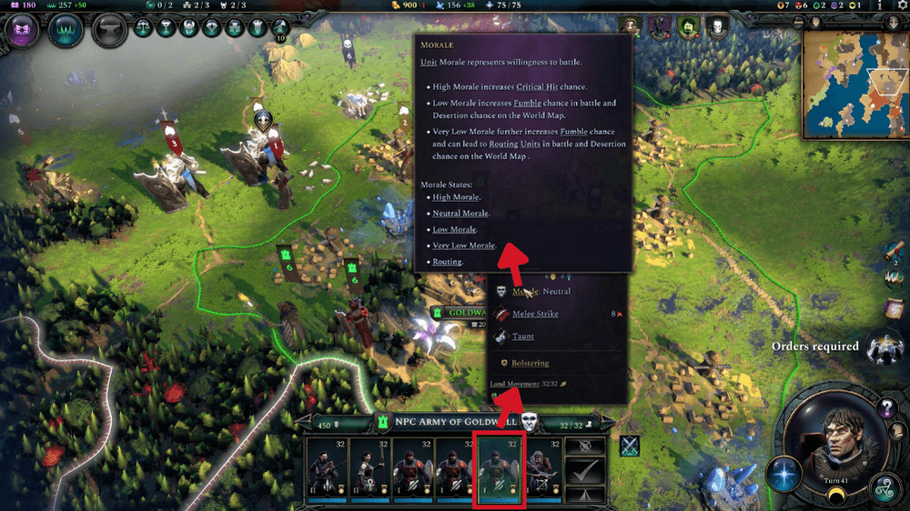
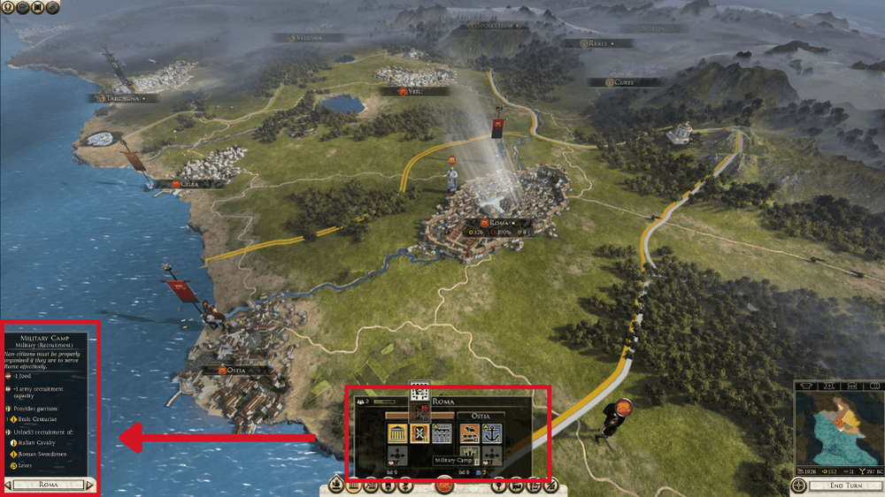
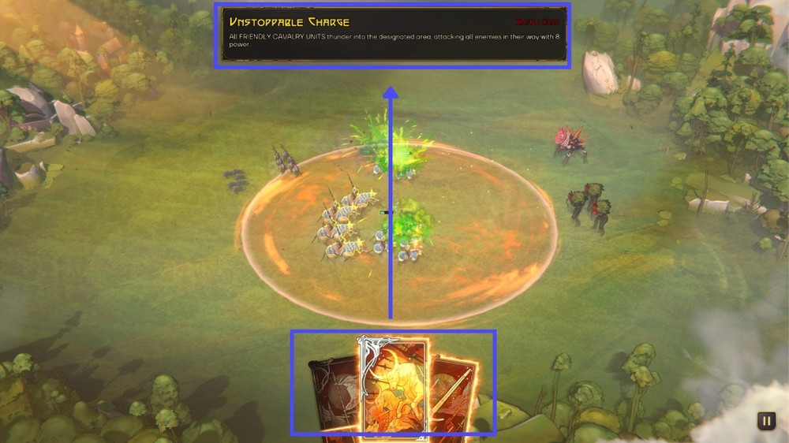
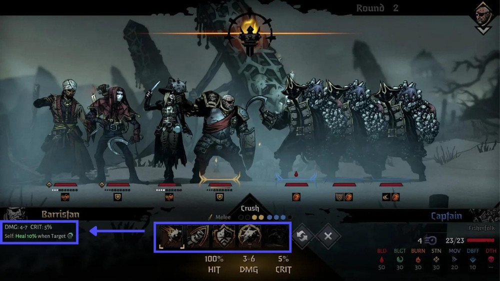
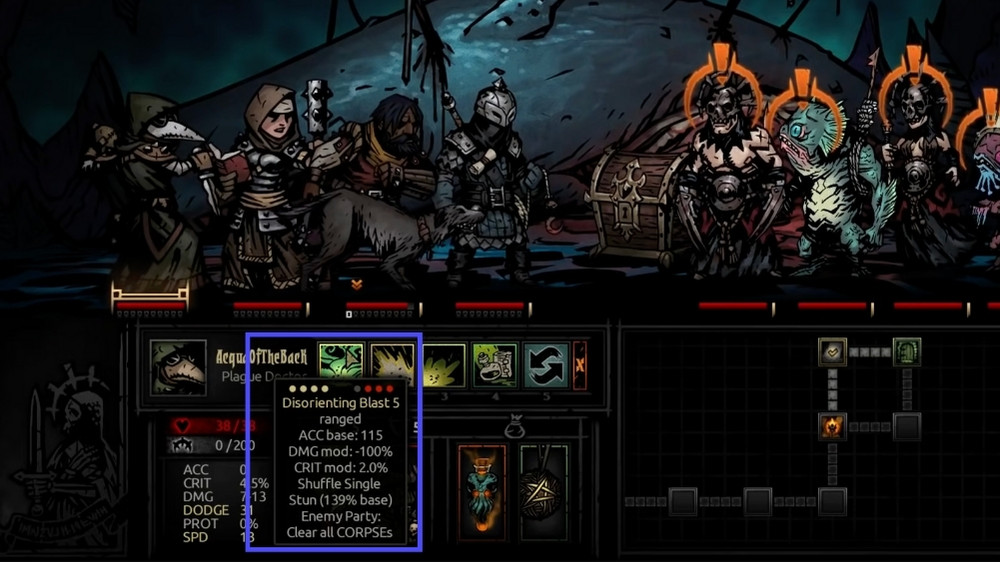

Apps and websites are the first thing most people think of when they hear UX/UI, but I'd argue that designing the interface for an advanced strategy game presents one of the most complex UI challenges out there.

Designing an UI that conveys information on units, leaders, cities, technologies, resources, and terrain features without completely overwhelming the player AND still looking visually appealing enough to draw new players in is a daunting task. And yet, over the last decade or so, these interfaces have become shockingly good at doing just that.

Take a look at this screenshot from _Age of Wonders 4_.

<em>Age of Wonders 4</em>  

This interface contains over 50 pieces of information, and yet it feels extremely approachable and user-friendly thanks to its masterful implementation of hierarchy, contrast, color, and balance. Related metrics and actions are grouped together, and the most important pieces of information are given the most visual weight.

However, the UIs in strategy games aren't always flawless, and I've recently started to notice how many modern games are guilty of a particularly maddening design issue despite being otherwise well designed. It started when I recently revisited an old favorite, Total War: Rome 2.

## I came, I saw, I hovered

One of the most significant UI advancements in modern strategy games is the expectation that hovering over just about anything item on the screen will reveal a tooltip explaining that item's function. These tooltips are crucial for understanding the game's complex mechanics without cluttering the screen. Take a look at how _Age of Wonders 4_ uses nested tooltips to make sure that every concept is within easy reach of the user.

<em>Age of Wonders 4</em> uses nested tooltips, where hovering over a unit in triggers a tooltip, which you can hover to trigger another tooltip, etc. 

Want to learn more about a particular unit? Hover over it. Ok, it says it the unit has the trait “Fortified”, but what does that mean? Hover over the word Fortified, which is handily underlined to demonstrate it can be hovered. Ok, Fortified increases a unit’s defense. How does a unit’s defense work? Hover over “Defense” and… you get the idea.

However, when I tried to hover over building options in _Total War: Rome 2_, I saw no tooltip. After a solid minute of trying to understand why the tips weren’t firing, I realized that they were in fact appearing, but all the way in the bottom left corner of my screen. Even on a standard 27” monitor, this required my eyes to traverse over 12” to read the tooltip, then dart back to select another option, an experience that was both jarring and disruptive considering I had to do this nearly a dozen times just to make a single decision.

Annoying tooltip placement in <em>Total War: Rome 2</em> 

This UI design flaw blatantly violates one of the core principles of UI design: proximity. The principle requires that related elements are placed together to streamline user interaction and comprehension. Instead, this design choice forces users to repeatedly scan back and forth across the screen, significantly hampering the user experience and making information harder to consume.

## _Songs of Silence_

I initially chalked this flaw up to the game being a decade old, but I was dismayed to encounter the exact same issue a few days later in a demo for an upcoming title, _Songs of Silence_. Now, it’s worth mentioning that _Songs of Silence_ has the most stunning illustrations I’ve ever seen in a game, full stop. You can tell that this game was a true labor of love for a talented design team, which makes it all the more frustrating that I ran across the exact same issue.

During the game's combat phase, units will automatically engage in typical auto-battler fashion. However, the player can affect the outcoming by using abilities, which are represented as cards displayed at the screen's bottom. Despite their stunning artwork, these cards lack any information about their functions. As much as I love the gorgeous illustrations, this design decision makes it exceedingly difficult to understand what exactly I’m about to cast.

<em>Songs of Silence</em> is beautiful, but the placement of tooltips is hideous.

Every time I wanted to understand the cards in my hand, I would have hover over the card, move my eyes to the top of the screen, move by eyes back down to the screen so I could hover over the next card, etc. All the while I’m missing the visually impressive battle unfolding before me (and likely missing the opportune window to cast my abilities).

## _Darkest Dungeon 2_

The issue reached a peak of frustration when trying another new, equally visually impressive game, _Darkest Dungeon 2_. When trying to understand my character’s abilities, my eyes once again had to perform some uncomfortable ocular gymnastics.

In an exact replica of _Rome 2’s_ UI, highlighting an ability will display a tooltip in the bottom right of the screen. Even playing on the compact screen of a Steam Deck, this design choice was jarring and made it take significantly longer for me to understand my available actions.

<em>Darkest Dungeon 2</em>

This was particularly baffling given that the original _Darkest Dungeon_ had already solved this problem by displaying tooltips directly adjacent to the hovered item.

The original <em>Darkest Dungeon</em> had a far superior UI.

This is a massive downgrade, and overall, I found the interfaces of the sequel to be significantly harder to navigate than the original for a myriad of reasons.

## Good Graphic Design !== Good UX

The role of a UX designer requires navigating the delicate balance between aesthetics and functionality, and often entails pushing back against visually appealing designs that sacrifice practicality for beauty. The allure of a "pretty" interface should never overshadow the paramount importance of usability. Thankfully, creating a user interface that excels in both aesthetics and functionality is not an either/or proposition, though it does demand more time to perfect. But in the end, the extra effort is _always_ worth the results.

